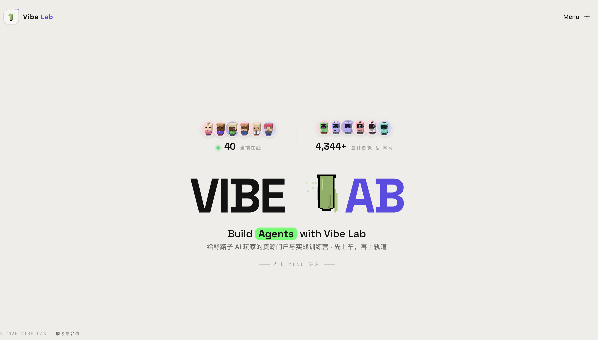

# 🧪 VIBE LAB · 振动实验室

**AI 时代的野路子训练场 —— 工具在手、作品说话**

> 面向想用 AI 真正做出东西的人：从 0 上手 AI 工具，到独立做出自己的作品，
> 再到把作品摆上台、被更多人看见。

[🌐 在线站点](https://www.labagent.online) · [🔧 工具库](https://www.labagent.online/tools) · [📚 教程库](https://www.labagent.online/tutorials) · [🧪 实验室](https://www.labagent.online/lab) · [📮 联系](https://www.labagent.online/contact)

---

---

## 📑 目录

- [🎯 这是个什么产品](#这是个什么产品)
- [🧩 四大板块](#四大板块)
- [🛠 技术栈](#技术栈)
- [🤝 共建与创作者](#共建与创作者)
- [🗺 Roadmap](#roadmap)
- [⚖️ License](#license)

---

## 这是个什么产品

Vibe Lab 不是又一个工具合集站，也不是纯教程站——它是把「学会用 AI」和「**做出作品**」焊在一起的训练场：

- **工具怎么用** → 把好用的 AI 工具一次装齐，按用途分类、逐个上手讲明白；
- **教程怎么读** → 高质量开源教程整本搬进站内，从入门通识到 Agent 实战，跟着顺序读完就真的会了；
- **作品怎么做完** → 三档实战训练营，从上手工具一路做到作品打磨上线、个人网站收官（付费内容）；
- **做出来之后** → 创作者把作品摆上「实验室」，被更多人看见——这是平台的里子。

> **野路子也值得被认真对待。** 这里不背理论、第一节就动手，把好用的「邪修」打法系统化，一样能做出正经作品。

## 四大板块

| 板块 | 做什么 | 免费？ |
|---|---|---|
| **🔧 工具库** | 70+ 精选 AI 工具，按用途分类收录，附上手介绍 | ✅ 永久免费 |
| **📚 教程库** | 开源 AI 教程站内精读，整本读完不跳来跳去 | ✅ 永久免费 |
| **🎓 实战训练营** | Starter / Builder / Hacker 三档，录播+作业+点评，亲手做出能上线的作品 | 💰 付费（邀请码体验 → 解锁码开课） |
| **🧪 实验室 Lab** | 创作者作品展示场：作品摆上台，被更多人看见 | ✅ 免费入驻（白名单制） |

训练营内容为**付费内容**：感兴趣可先联系获取邀请码，免费试看每个课包的「体验课」再决定；付费后解锁全部课程，永久回看。

## 技术栈

| 层 | 选型 |
|---|---|
| 框架 | **Next.js 15**（App Router）· **TypeScript** · GSAP |
| 数据 | **GitHub 即数据仓**（`creators/` 创作者中枢）+ jsdelivr CDN 兜底 |
| 质量 | JSON Schema + `validate` 校验 · CI 白名单闸（作者须已入驻） |
| AI | **MiniMax**（作品 AI 封面 / 摘要）· **DeepSeek**（Lab Agent 助手） |

## 共建与创作者

Lab 欢迎每一个把作品摆上台的人——**白名单制，先邮件申请**：

1. 发邮件至 `zfu9751@gmail.com`，写明 GitHub 用户名、想要的花名、简介、（可选）代表作；
2. 站长审核通过后把你加入花名册 `creators/index.json`（入册即放行）；
3. 之后你改 `creators/<handle>/profile.json` / `works.json` 提交 PR，自动校验通过、站长 review 后合入即上线。

**给创作者/贡献者的文档**（按阅读方式二选一，内容互补）：
- 🧑‍🎓 人读教程：[`creators/README.md`](creators/README.md) —— 入驻与日常操作
- 🤖 AI Agent 操作手册：[`AGENTS.md`](AGENTS.md) —— 白名单 / sync / 封面 SOP

**协议**：工具库 / 教程库 / 实验室内容永久免费；训练营课程与创始人亲自指导为付费内容。

## Roadmap

- ✅ **v1** 工具库 · 教程库 · 实验室
- ✅ **v2** 仓库转公开 · main 分支保护 · 创作者白名单 CI · 删报名页 · 关于&联系融合 · 训练营「邀请码 + 解锁码」两把锁 · 数据协议 schema 化（profile/works/sync）
- ✅ **v3** 正式上线 `labagent.online` · AI 封面链路 · Lab Agent（DeepSeek）接入
- 🚧 **进行中** Lab Agent：从问询助手 → 真正能帮上忙的 AI 产品
- 🔮 **规划** 付费账号体系（替代浏览器轻量解锁）· 创作者素材上传 · 站内搜索 · 录播内容私有托管

## License

本仓库代码采用 **[Apache License 2.0](LICENSE)** —— 可自由使用、修改、分发（含商业用途），保留版权声明即可。

内容版权边界（与代码许可相互独立）：
- **工具库 / 教程库**：收录链接指向官方来源；教程内容来自 GitHub 开源项目，版权归原作者，站内阅读页标注作者与开源协议；
- **创作者作品**（`creators/`）：版权归创作者本人；
- **训练营课程与创始人指导**：付费内容，观看授权随课程购买发放，不得转售/再分发。

---

如果这个项目对你有一点点帮助——**去站点逛逛、把作品摆上台、或给个 ⭐**，都是我们继续做下去的动力。

**做出来，摆上台，被看见。**

